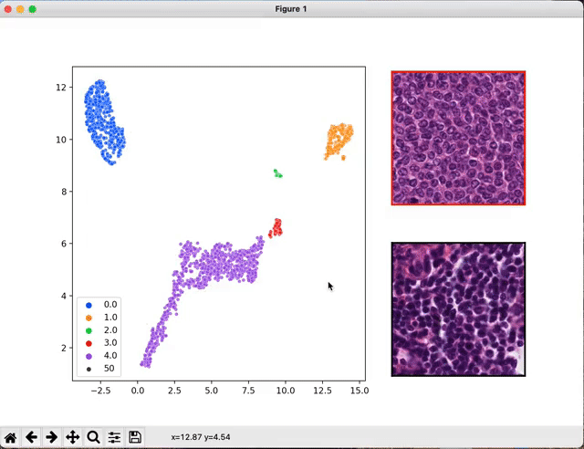

# Whole Slide Image processing with deep-learning 

This repository contains the code for the paper [Deep learning identifies morphological patterns of homologous recombination deficiency in luminal breast cancers from whole slide images](https://www.cell.com/cell-reports-medicine/fulltext/S2666-3791(22)00436-0).

In order to use the scripts present in this repository, make sure that you are working in a python environment that satisfies the requirements of
`requirement.txt`.
Then, enter the `pkg` folder and install it:

```
cd pkg; pip install -e ./
```

With three simple steps, each of them being one command-line action, the package will allow you to
train a machine learning algorithm to classify whole slide images in tif, ndpi or svs format.

The three steps are the following:

1. [Tile and encode your WSIs](#tiling-and-encoding-your-wsis)
2. [Train machine learning models](#training-a-mil-model-and-using-it)
3. [Visualize what your models have learned](#visualizing-your-mil-model)

## Tiling and encoding your WSIs

# tiling-encoding

The first thing to do when processing a WSI is to tile it.
To do that you will just have to have a directory containing all the WSIs of your dataset.
*Allowed formats are ndpi, svs and tif*

The script `./scripts/main_tiling.py` tiles either a single image or all the images contained in
a directory.

Here is a usage example:

```python
python ./scripts/main_tiling.py --path_wsi /folder/with/wsi --size 224 --tiler simple --level 2 path_outputs /my/output/folder
```

The possible arguments are :

* `path_wsi`: `str`, the path where are stored the WSI (or of a single WSI).
* `level` : 'int', resolution level for tiling. The smallest, the highest resolution.
Correspond to the level of the pyramidal format.
* `size`: `int` size of the squared tiles, in pixels.
* `tiler`: tiler to use. simple -> just cuts the WSI in png.
imagenet -> encodes the tiles with a ResNet18 pre-trained on imagenet.
moco -> encodes the tiles with a ResNet18 pre-trained with MoCo (need a pretrained model).
* `model_path`: `str` path to the MoCo model. Use only when `tiler == moco`
* `path_outputs`: `str` path to store the outputs.

The outputs of this script are different when using the `simple` tiler or when using the
`imagenet` or `moco` tilers.
When using the `simple` tiler:

* `path_outputs`:
  * `name_wsi_1`:
    * `tile_1.png`
    * ...
  * `name_wsi_2`:
    * ...
  * ...
  * `info`
  * `visu`
When using the 'imagenet' or 'moco' tiler
* `path_outputs`:
  * `mat`:
    * `name_wsi_1.npy`
    * ...
  * `mat_pca`:
    * `name_wsi_1.npy`
    * ...
  * `pca`
  * `info`
  * `visu`

`info` contains information on the localization of tiles on the WSI.
`visu` contains images visualizing the tiling. It can allow controlling that the tiling went well,
especially when tiles are directly encoded and therefore cannot be checked visually.
`pca` contains the PCA-object that was fit to the entirety of the dataset. `pca/results.txt` shows the evolution of the explained variance for each of the PCA dimensions.
`mat` contains the embedded WSIs, in NumPy format.
`mat_pca` contains the projection of the embedded WSI on the PCA dimensions, computed on the whole dataset.

## Training a MIL model and using it

### Preparing the master-table

In order to train a model, you will need a master table containing the ground truth labels.
The master table must be in CSV format, with a comma ',' as a separator. It must contain at least 2 columns:

* `ID`: contains the identifiers of the slides. ID is the name under which are stored the WSI.
For instance, ID for a slide stored at `/path/folder/AB446700.svs` is `AB446700`.
* `output_variable`: contains the ground-truth labels for each WSI. The name of the column can be whatever you want.

It might contain other columns, for example, if you want to correct for a given bias

Before running your experiment, you will have to manually split the dataset into test and train sets.
For that aim, use  `./scripts/split_dataset.py`:

```bash
python --table /path/master/table --target_name output_variable --equ_vars bias1,bias2,bias3 -k 5
```

`target_name` has to be set with the name of the column containing the ground truth label.
`equ_vars` have to be set with other variables with respect to which we want to stratify the sets. Facultative. Different variables have to be separated by `,`
and each of them corresponds to a column name of the master table.

The master table now contains a column `test` with the splits information.

### Preparing the configuration file

Model hyperparameters for training are all set in a simple YAML file.
A default config file is provided in this repository `config_default.yaml`.
The parameters set in `config_default.yaml` are the input arguments of the train scripts.

* `batch_size`: number of WSIs per batch.
* `dropout`: dropout parameter for each Dropout layer (in all implemented MLP).
* `feature_depth`: number of features used for inference. Because we encode with a Resnet18, must be less than 512.
Check the result of the PCA to see how much the dimensions explain the variance. Putting a small number here can dramatically
reduce the computation time while preserving most of the performance.
* `lr`: learning rate.
* `num_workers`: number of parallel threads span for a batch generation.
* `model_name`: name of the model. Available  mhmc_layers, multiheadmil, conan, 1s.
* `table_data`: path to the master table, already split between test and train (see the previous paragraph).
* `nb_tiles`: int, number of tiles per WSI sampled when creating a batch. If set to 0, then the "whole" whole slide is taken each time.
We observed a regularizing effect of this parameter. We thus recommend setting it low when dealing with a small dataset.
* `epochs`: number of epochs
* `target_name`: name of the target variable, as it appears in the master table.
* `ref_metric`: metric to use for model selection and early stopping. Available: loss, accuracy, auc_roc (when solving a binary classification), f1, precision, recall.
* `wsi`: path to the output folder of the tiling script: it must contain the `info`, `mat`, `mat_pca`,  `pca` and `visu` subfolders.
* `raw_path`: path to the WSI in their original format (ndpi, svs or tif).

### TRAIN

The default training protocol is the one developed in the article. It uses a nested cross-validation scheme to estimate the prediction performances.
To launch a training, use `./scripts/train_cross_val.py`.
The arguments to feed this script are:

* `out` : path for the output of the training process.
* `name`: the identifier for the experiment.
* `rep`: number of repetitions of training for a given training set.
* `config`: path to the configuration file.
* `n_ensemble`: for each repetition of training you obtain a different model.
You can finally test an ensemble of the `n_ensemble` better models w.r.t their validation result. default is to 1.

The output folder of a typical training process is as follows:

* `out`:
  * *all_results.csv*: validation results of all the trained models.
  * *mean_over_repeats.csv*: average of the validation results for a given test set.
  * *final_results.csv*: performance results estimated on the test sets.
  * *results_table.csv*: test-prediction for the whole dataset.
  * `test_0`:
    * `rep_0`:
      * *config.yaml*: configuration file used for this particular training.
      * *model_best.pt.tar*: checkpoint for the best model w.r.t to the validation performances.
      * *model.pt.tar*: checkpoint for the model at the end of the training.
      * `runs`: contain the tensorboard files to follow the trainings.
    * `rep_1`:
    * ...
  * ...
  * `test_n`
  * *model_best_test_0_repeat_1.pt.tar*: best model among the `rep` models trained with the test set 0.
    `n_ensemble` of them are extracted for each test set.

> *final_results.csv* is the file to look at for the final estimation performances.

NB: If your dataset is unbalanced with respect to the target variable, a correction is
automatically applied with oversampling.
NB NB: If a GPU is available, the model will automatically train on it.

## Visualizing your MIL model

Once your models are trained and the classification performances are estimated, you may want to
have a look at the WSI features the networks looked at.

The script `seek_best_tiles.py` allows the extraction of the most predictive tiles for each value of the target variables.

```
python ./scripts/seek_best_tiles.py --model /path/to/model/checkpoint.pt.tar --n_best 1000 --max_per_slides 20
```

Help concerning the different arguments is available with `python ./scripts/seek_best_tiles.py -h`.
You must set `max_per_slide` and `n_best` such that `max_per_slide` * `N` >> `n_best`, N being the size of the dataset.

The outputs of this visualization process are stored in the folder where is located the tested model, for example in 'summaries_model_best_test_0_rep_0'
if you used the repetition 0 of the model trained on the split 0.
This folder contains several sub-folders, namely:

* `hightiles` *contains the predictive tiles for each value of the target variable.*
  * `target_value_1`
    * *tile_0.jpg*
    * ...
    * *tile_n_best.jpg*
  * ...
  * `target_value_n`
* `hightiles_encoded` *contains information about the extracted tiles*
  * *target_value_1_attention.npy* : `n_best x 1` matrix, attention scores of the extracted tiles for the first target value.
  * *target_value_1_preclassif.npy*: `n_best x D` matrix of the decision embeddings of the tiles.
  * *target_value_1_scores.npy*: `n_best x 1` matrix, logits of the *target_value_1* of the tiles.
  * *target_value_1.npy*: `n_best x F` matrix, imagenet or MoCo embeddings of the extracted tiles for the first target value.
  * ...

With `D` the dimension of the last layer of the decision module and `F` the MoCo or
Imagenet embedding dimension (`F=512` when encoding with a ResNet18).

If you are working on a distant device, you may want to migrate the outputs of the visualization script to your local computer.
You can use downloading tools such as `scp` or `rsync`.
Once the output folder of the visualization is on your local computer (with the same python environment as the one on the distant device),
you will be able to use the script `interactive_visualization.py`.

```
python scripts/interactive_visualization.py --path path/to/the/visu/outputs --target_val value_0 --cluster
```

An interactive window will pop up that will allow you to navigate through the extracted tiles.


